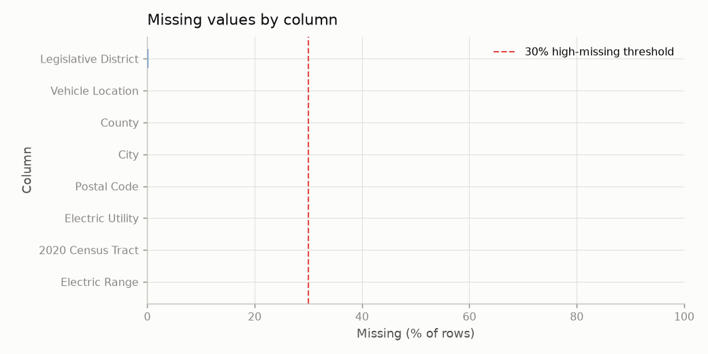
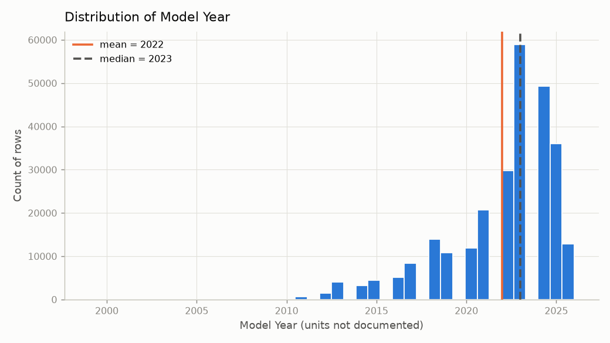
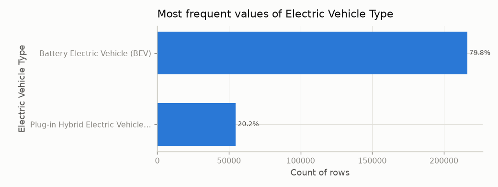
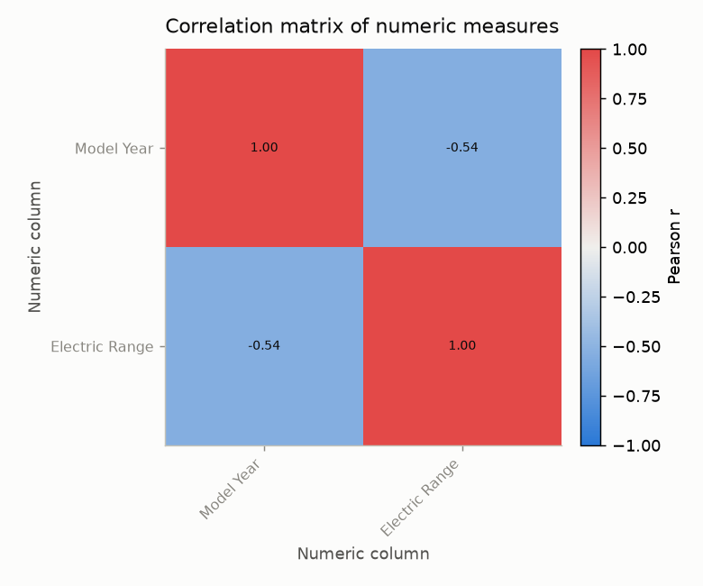
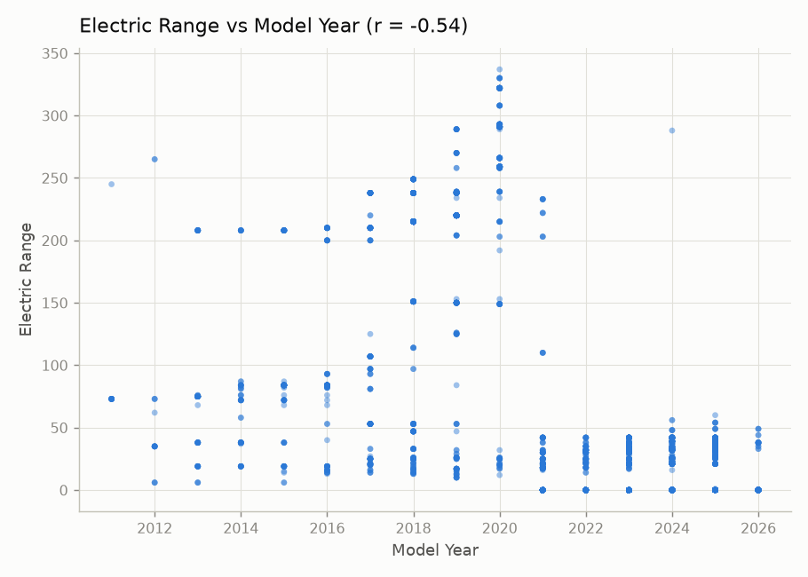
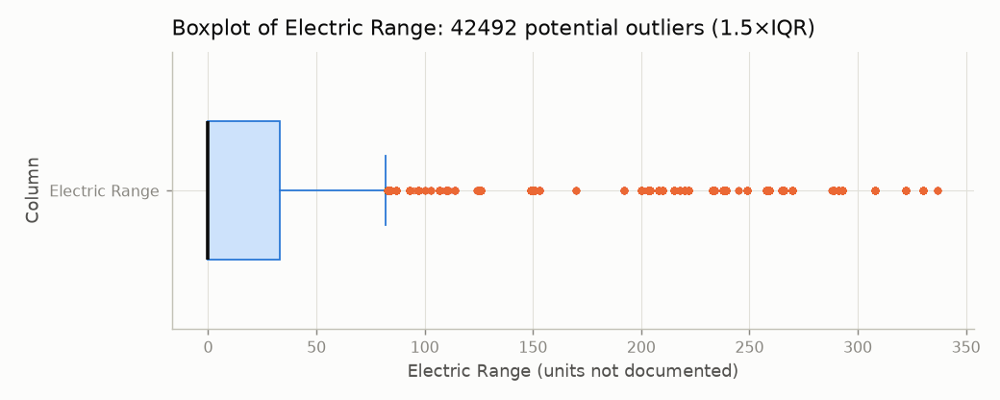
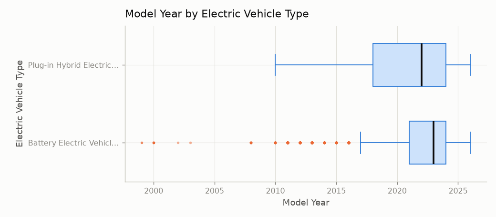
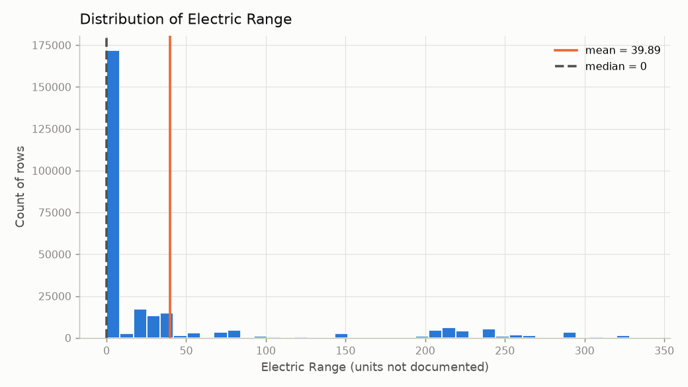

# Automated Data Profile: `dataset_a.csv`

*Generated by `profiler.py` on 2026-09-27 19:15:12. All statistics were computed by Python; the AI narrative (if present) only explains them and is automatically checked.*

## 1. Dataset overview

| Item | Value |
|---|---|
| File | `dataset_a.csv` |
| Rows | 271,113 |
| Columns | 16 |
| Encoding used to read file | utf-8 |
| Role counts | Categorical attribute: 11, Identifier-like field: 3, Numeric measure: 2 |

### Column profile

| Column | Inferred type | Probable role | Non-missing | Missing % | Unique | Notes |
|---|---|---|---:|---:|---:|---|
| `VIN (1-10)` | string | Categorical attribute | 271,113 | 0.0 | 16,671 | high-cardinality categorical (16671 categories); only top values reported |
| `County` | string | Categorical attribute | 271,103 | 0.0 | 246 |  |
| `City` | string | Categorical attribute | 271,103 | 0.0 | 870 |  |
| `State` | string | Categorical attribute | 271,113 | 0.0 | 51 |  |
| `Postal Code` | integer | Identifier-like field | 271,103 | 0.0 | 1,098 | numeric-looking code (name suggests ZIP/FIPS/census/district/phone/code); arithmetic statistics not meaningful |
| `Model Year` | integer | Numeric measure | 271,113 | 0.0 | 22 |  |
| `Make` | string | Categorical attribute | 271,113 | 0.0 | 47 |  |
| `Model` | string | Categorical attribute | 271,113 | 0.0 | 184 |  |
| `Electric Vehicle Type` | string | Categorical attribute | 271,113 | 0.0 | 2 |  |
| `Clean Alternative Fuel Vehicle (CAFV) Eligibility` | string | Categorical attribute | 271,113 | 0.0 | 3 |  |
| `Electric Range` | integer | Numeric measure | 271,106 | 0.0 | 113 |  |
| `Legislative District` | integer | Categorical attribute | 270,454 | 0.24 | 49 | numeric-looking code (name suggests ZIP/FIPS/census/district/phone/code); arithmetic statistics not meaningful |
| `DOL Vehicle ID` | integer | Identifier-like field | 271,113 | 0.0 | 271,113 | unique integer sequence or ID-like name; excluded from statistics that assume a measurement |
| `Vehicle Location` | string | Categorical attribute | 271,025 | 0.03 | 1,095 |  |
| `Electric Utility` | string | Categorical attribute | 271,103 | 0.0 | 77 |  |
| `2020 Census Tract` | integer | Identifier-like field | 271,103 | 0.0 | 2,349 | numeric-looking code (name suggests ZIP/FIPS/census/district/phone/code); arithmetic statistics not meaningful |

*Roles are inferred from values and names only. Column meanings, units, and valid ranges are not documented in the CSV, so they are not assumed.*

## 2. Data quality

- **Duplicate rows:** 0 (0.0%)
- **Missing cells overall:** 804 (0.02% of all cells), in 8 column(s)
- **High-missingness columns (≥ 30.0%):** none
- **Constant (single-value) columns:** none
- **Completely empty columns:** none
- **Mixed / inconsistent types:** none detected
- **Identifier-like / high-cardinality columns:** `Postal Code` (1,098 unique), `DOL Vehicle ID` (271,113 unique), `2020 Census Tract` (2,349 unique)
- **Potentially sensitive columns (heuristic):** `Postal Code` (column name suggests postal code)

> Sensitive-field detection is a name/pattern heuristic only. The absence of a warning does NOT mean the dataset is free of sensitive information.

> No rows, values, or outliers were removed or changed. Problems are flagged only.

## 3. Descriptive statistics

### Numeric columns

| Column | Valid | Missing (%) | Min | Q1 | Median | Mean | Q3 | Max | Std | IQR | Mode | Outliers (%) |
|---|---:|---:|---:|---:|---:|---:|---:|---:|---:|---:|---|---:|
| `Model Year` | 271,113 | 0 (0.0) | 1999.0 | 2021.0 | 2023.0 | 2021.9951 | 2024.0 | 2026.0 | 3.0567 | 3.0 | 2023.0 | 18,702 (6.9) |
| `Electric Range` | 271,106 | 7 (0.0) | 0.0 | 0.0 | 0.0 | 39.8856 | 33.0 | 337.0 | 78.7644 | 33.0 | 0.0 | 42,492 (15.67) |

*Outliers use the 1.5×IQR rule: values below Q1 − 1.5·IQR or above Q3 + 1.5·IQR. They are potential outliers to investigate, not errors. Std is the sample standard deviation (n − 1). Mode is shown only when values repeat.*

### Categorical and Boolean columns

**`VIN (1-10)`** — 16,671 categories, 271,113 non-missing. Most frequent: '7SAYGDEE7P' (1,153 rows, 0.43%).

| Value | Count | % of non-missing |
|---|---:|---:|
| 7SAYGDEE7P | 1,153 | 0.43 |
| 7SAYGDEE6P | 1,139 | 0.42 |
| 7SAYGDEEXP | 1,130 | 0.42 |
| 7SAYGDEE5P | 1,130 | 0.42 |
| 7SAYGDEE8P | 1,114 | 0.41 |
| 7SAYGDEE2P | 1,088 | 0.4 |
| 7SAYGDEE0P | 1,074 | 0.4 |
| 7SAYGDEE9P | 1,070 | 0.39 |
| 7SAYGDEE3P | 1,062 | 0.39 |
| 7SAYGDEE4P | 1,047 | 0.39 |
| *(16,661 other categories)* | 260,106 | 95.94 |

**`County`** — 246 categories, 271,103 non-missing. Most frequent: 'King' (133,815 rows, 49.36%).

| Value | Count | % of non-missing |
|---|---:|---:|
| King | 133,815 | 49.36 |
| Snohomish | 33,766 | 12.46 |
| Pierce | 22,238 | 8.2 |
| Clark | 16,694 | 6.16 |
| Thurston | 9,911 | 3.66 |
| Kitsap | 9,116 | 3.36 |
| Spokane | 7,652 | 2.82 |
| Whatcom | 6,664 | 2.46 |
| Benton | 3,827 | 1.41 |
| Skagit | 3,194 | 1.18 |
| *(236 other categories)* | 24,226 | 8.94 |

**`City`** — 870 categories, 271,103 non-missing. Most frequent: 'Seattle' (42,105 rows, 15.53%).

| Value | Count | % of non-missing |
|---|---:|---:|
| Seattle | 42,105 | 15.53 |
| Bellevue | 13,122 | 4.84 |
| Vancouver | 10,136 | 3.74 |
| Redmond | 9,242 | 3.41 |
| Bothell | 8,936 | 3.3 |
| Kirkland | 7,702 | 2.84 |
| Sammamish | 7,539 | 2.78 |
| Renton | 7,448 | 2.75 |
| Olympia | 6,366 | 2.35 |
| Tacoma | 5,900 | 2.18 |
| *(860 other categories)* | 152,607 | 56.29 |

**`State`** — 51 categories, 271,113 non-missing. Most frequent: 'WA' (270,454 rows, 99.76%).

| Value | Count | % of non-missing |
|---|---:|---:|
| WA | 270,454 | 99.76 |
| CA | 153 | 0.06 |
| VA | 80 | 0.03 |
| MD | 43 | 0.02 |
| TX | 40 | 0.01 |
| FL | 39 | 0.01 |
| OR | 27 | 0.01 |
| CO | 25 | 0.01 |
| IL | 21 | 0.01 |
| AZ | 17 | 0.01 |
| *(41 other categories)* | 214 | 0.08 |

**`Make`** — 47 categories, 271,113 non-missing. Most frequent: 'TESLA' (110,537 rows, 40.77%).

| Value | Count | % of non-missing |
|---|---:|---:|
| TESLA | 110,537 | 40.77 |
| CHEVROLET | 19,044 | 7.02 |
| NISSAN | 15,955 | 5.88 |
| FORD | 14,938 | 5.51 |
| KIA | 13,617 | 5.02 |
| TOYOTA | 11,381 | 4.2 |
| BMW | 11,202 | 4.13 |
| HYUNDAI | 9,828 | 3.63 |
| RIVIAN | 8,511 | 3.14 |
| VOLKSWAGEN | 7,368 | 2.72 |
| *(37 other categories)* | 48,732 | 17.97 |

**`Model`** — 184 categories, 271,113 non-missing. Most frequent: 'MODEL Y' (57,324 rows, 21.14%).

| Value | Count | % of non-missing |
|---|---:|---:|
| MODEL Y | 57,324 | 21.14 |
| MODEL 3 | 37,067 | 13.67 |
| LEAF | 13,450 | 4.96 |
| BOLT EV | 7,690 | 2.84 |
| MODEL S | 7,686 | 2.83 |
| MODEL X | 6,637 | 2.45 |
| MUSTANG MACH-E | 6,230 | 2.3 |
| ID.4 | 5,970 | 2.2 |
| IONIQ 5 | 5,603 | 2.07 |
| WRANGLER | 4,973 | 1.83 |
| *(174 other categories)* | 118,483 | 43.7 |

**`Electric Vehicle Type`** — 2 categories, 271,113 non-missing. Most frequent: 'Battery Electric Vehicle (BEV)' (216,316 rows, 79.79%).

| Value | Count | % of non-missing |
|---|---:|---:|
| Battery Electric Vehicle (BEV) | 216,316 | 79.79 |
| Plug-in Hybrid Electric Vehicle (PHEV) | 54,797 | 20.21 |

**`Clean Alternative Fuel Vehicle (CAFV) Eligibility`** — 3 categories, 271,113 non-missing. Most frequent: 'Eligibility unknown as battery range has not been researched' (170,815 rows, 63.01%).

| Value | Count | % of non-missing |
|---|---:|---:|
| Eligibility unknown as battery range has not been researched | 170,815 | 63.01 |
| Clean Alternative Fuel Vehicle Eligible | 76,207 | 28.11 |
| Not eligible due to low battery range | 24,091 | 8.89 |

**`Legislative District`** — 49 categories, 270,454 non-missing. Most frequent: '41.0' (16,468 rows, 6.09%).

| Value | Count | % of non-missing |
|---|---:|---:|
| 41.0 | 16,468 | 6.09 |
| 45.0 | 15,132 | 5.6 |
| 48.0 | 14,234 | 5.26 |
| 1.0 | 11,749 | 4.34 |
| 5.0 | 11,371 | 4.2 |
| 36.0 | 10,252 | 3.79 |
| 46.0 | 9,886 | 3.66 |
| 11.0 | 9,751 | 3.61 |
| 43.0 | 9,070 | 3.35 |
| 37.0 | 7,699 | 2.85 |
| *(39 other categories)* | 154,842 | 57.25 |

**`Vehicle Location`** — 1,095 categories, 271,025 non-missing. Most frequent: 'POINT (-122.13158 47.67858)' (6,523 rows, 2.41%).

| Value | Count | % of non-missing |
|---|---:|---:|
| POINT (-122.13158 47.67858) | 6,523 | 2.41 |
| POINT (-122.20105 47.84423) | 5,210 | 1.92 |
| POINT (-122.2066 47.67887) | 4,433 | 1.64 |
| POINT (-122.12096 47.55584) | 4,160 | 1.53 |
| POINT (-122.1872 47.61001) | 3,907 | 1.44 |
| POINT (-122.31676 47.68156) | 3,862 | 1.42 |
| POINT (-122.02054 47.60326) | 3,567 | 1.32 |
| POINT (-122.15545 47.75448) | 3,407 | 1.26 |
| POINT (-122.22901 47.72201) | 3,362 | 1.24 |
| POINT (-122.21238 47.57816) | 3,112 | 1.15 |
| *(1,085 other categories)* | 229,482 | 84.67 |

**`Electric Utility`** — 77 categories, 271,103 non-missing. Most frequent: 'PUGET SOUND ENERGY INC||CITY OF TACOMA - (WA)' (96,306 rows, 35.52%).

| Value | Count | % of non-missing |
|---|---:|---:|
| PUGET SOUND ENERGY INC\|\|CITY OF TACOMA - (WA) | 96,306 | 35.52 |
| PUGET SOUND ENERGY INC | 56,993 | 21.02 |
| CITY OF SEATTLE - (WA)\|CITY OF TACOMA - (WA) | 45,221 | 16.68 |
| BONNEVILLE POWER ADMINISTRATION\|\|PUD NO 1 OF CLARK COUNTY -… | 16,282 | 6.01 |
| BONNEVILLE POWER ADMINISTRATION\|\|CITY OF TACOMA - (WA)\|\|PEN… | 12,315 | 4.54 |
| PUGET SOUND ENERGY INC\|\|PUD NO 1 OF WHATCOM COUNTY | 6,287 | 2.32 |
| BONNEVILLE POWER ADMINISTRATION\|\|AVISTA CORP\|\|INLAND POWER … | 4,670 | 1.72 |
| BONNEVILLE POWER ADMINISTRATION\|\|PUD 1 OF SNOHOMISH COUNTY | 2,575 | 0.95 |
| PACIFICORP | 2,394 | 0.88 |
| BONNEVILLE POWER ADMINISTRATION\|\|PUD NO 1 OF BENTON COUNTY | 2,252 | 0.83 |
| *(67 other categories)* | 25,808 | 9.52 |

## 4. Relationships between variables

Method: Pearson correlation (pairwise complete observations) on 2 numeric measure columns (identifier-like columns excluded).

| Direction | Column A | Column B | Pearson r | Strength | Complete pairs |
|---|---|---|---:|---|---:|
| Negative | `Model Year` | `Electric Range` | -0.544 | moderate | 271,106 |

*Strength scale: |r| < 0.1 very weak, < 0.3 weak, < 0.7 moderate, >= 0.7 strong. Correlation measures linear association only and does not imply causation.*

## 5. Visualizations

### Figure 1. Missing values by column



*Why this plot:* Shows which columns are incomplete and which cross the high-missingness threshold.

### Figure 2. Distribution of Model Year



*Why this plot:* A histogram suits a continuous numeric measure: it shows shape, skew, and spread.

### Figure 3. Most frequent values of Electric Vehicle Type



*Why this plot:* A sorted bar chart compares category frequencies for a categorical attribute.

### Figure 4. Correlation matrix of numeric measures



*Why this plot:* A heatmap summarizes all pairwise linear correlations among numeric measures at once.

### Figure 5. Electric Range vs Model Year (r = -0.54)



*Why this plot:* A scatterplot shows the strongest numeric pair so the correlation can be checked visually (linearity, clusters, outliers).

### Figure 6. Boxplot of Electric Range: 42492 potential outliers (1.5×IQR)



*Why this plot:* A boxplot shows the median, IQR, and points beyond the 1.5×IQR fences (potential outliers).

### Figure 7. Model Year by Electric Vehicle Type



*Why this plot:* Side-by-side boxplots compare a numeric measure across the categories of a categorical attribute.

### Figure 8. Distribution of Electric Range



*Why this plot:* A histogram suits a continuous numeric measure: it shows shape, skew, and spread.

**Plots skipped and why:**

- Time-series plot: no date-like column detected
- catbar (Clean Alternative Fuel Vehicle (CAFV) Eligibility): plot budget of 8 reached

## 6. Key findings computed by Python

*These findings are generated from templates filled directly with values from `analysis_summary.json`; they are always produced, even without an LLM.*

1. **[Data Quality]** 804 cells (0.02%) are missing across 8 column(s); none exceeds the 30.0% threshold.  
   <sub>Evidence: `data_quality.total_missing_cells`</sub>
2. **[Distribution]** `Electric Range` has median 0.0 and mean 39.8856 (IQR 0.0 to 33.0); 42,492 values (15.67%) fall outside the 1.5×IQR fences [-49.5, 82.5] and are flagged, not removed.  
   <sub>Evidence: `numeric_statistics[Electric Range]`</sub>
3. **[Distribution]** `Electric Range` is strongly right-skewed (long upper tail): skewness 2.112, mean 39.8856 vs median 0.0, range 0.0 to 337.0. The median is the more robust center.  
   <sub>Evidence: `numeric_statistics[Electric Range].skewness`</sub>
4. **[Categorical]** In `State`, the most frequent value 'WA' accounts for 270,454 of 271,113 non-missing rows (99.76%) across 51 categories.  
   <sub>Evidence: `categorical_statistics[State]`</sub>
5. **[Relationship]** The strongest linear relationship found is between `Model Year` and `Electric Range` (Pearson r = -0.544, moderate, n = 271,106 complete pairs). This is an association, not evidence of causation.  
   <sub>Evidence: `relationships.strongest_positive / strongest_negative`</sub>
6. **[Limitation]** Limitation: 1 column(s) were flagged as potentially sensitive by name/pattern heuristics; column meanings and units are not documented in the file, so no units or definitions are assumed.  
   <sub>Evidence: `columns, data_quality`</sub>
7. **[Follow-Up Question]** Question for further investigation: Does the association between `Model Year` and `Electric Range` hold within subgroups, or is it driven by a third variable?  
   <sub>Evidence: `derived from the findings above`</sub>

## 7. AI-assisted narrative insights

*Model: `llama3.2` via Ollama. Prompt saved in `llm_prompt.txt`, raw response in `llm_response.txt`. The model received only the Python-verified summary. Attempts: 1.*

1. [Data quality] The dataset contains 271113 rows, but 804 cells are missing, which is 0.02% of the total rows.
2. [Distribution] The `Model Year` column has a mean of 2021.9951 and a standard deviation of 3.0567, indicating a relatively narrow range of values.
3. [Categorical] The `Electric Vehicle Type` column has only 2 unique categories, with `Battery Electric Vehicle (BEV)` being the most common, accounting for 79.79% of the values.
4. [Relationship] The correlation between `Model Year` and `Electric Range` is moderate, with a Pearson correlation coefficient of -0.544.
5. [Limitation] The `Clean Alternative Fuel Vehicle (CAFV) Eligibility` column has a high percentage of unknown eligibility (63.01%), which may indicate a need for further investigation.
6. [Question] What is the relationship between the `Postal Code` column and the `Electric Utility` column, given that the `Postal Code` column is identified as potentially sensitive?

### Automatic verification of the AI narrative

Every number in the response was compared with the values in `analysis_summary.json` (matching at the precision the model wrote). Each number must match a value Python computed for the column(s) the claim names, or a dataset-wide value such as the row count. Statistic words (mean, median, std, min, max, skewness, IQR, correlation) are checked against that exact statistic. "✓ numbers verified" does NOT mean the wording or reasoning is correct; a person must still read every claim.

| # | Claim (truncated) | Columns named | Numbers checked | Numbers not found for those columns | Statistic mismatches | Causal wording | Status |
|---|---|---|---:|---|---|---|---|
| 1 | [Data quality] The dataset contains 271113 rows, but 804 cells are missing, which is 0.02… | none (weak check) | 3 | – | – | – | ✓ numbers verified |
| 2 | [Distribution] The `Model Year` column has a mean of 2021.9951 and a standard deviation o… | `Model Year` | 2 | – | – | – | ✓ numbers verified |
| 3 | [Categorical] The `Electric Vehicle Type` column has only 2 unique categories, with `Batt… | `Electric Vehicle Type` | 1 | – | – | – | ✓ numbers verified |
| 4 | [Relationship] The correlation between `Model Year` and `Electric Range` is moderate, wit… | `Model Year`, `Electric Range` | 1 | – | – | – | ✓ numbers verified |
| 5 | [Limitation] The `Clean Alternative Fuel Vehicle (CAFV) Eligibility` column has a high pe… | `Clean Alternative Fuel Vehicle (CAFV) Eligibility` | 1 | – | – | – | ✓ numbers verified |

**Verification summary:** 8 numbers checked, 8 matched the Python summary, 0 did not; 0 claim(s) had a statistic mismatch; 0 claim(s) used causal wording.

## 8. Limitations of this automated analysis

- Type and role inference is heuristic (value parsing and column-name patterns); it can misclassify coded numbers, ZIP codes, or IDs.
- Column meanings, units, and valid ranges are not known unless documented; the report does not assume them.
- Outliers are flagged with the 1.5×IQR rule, which assumes a roughly symmetric distribution and over-flags skewed data.
- Pearson correlation captures only linear association, is sensitive to outliers, and never establishes causation.
- Sensitive-data detection is a heuristic; no warning does not mean the data is safe.
- The LLM narrative may still contain wording problems that the automatic number check cannot catch; it must be reviewed by a person.

## 9. Configuration used

```json
{
  "missing_threshold_pct": 30.0,
  "numeric_parse_threshold": 0.95,
  "date_parse_threshold": 0.9,
  "high_cardinality_ratio": 0.9,
  "max_categories": 50,
  "free_text_min_avg_len": 30,
  "top_k_categories": 10,
  "max_plots": 8,
  "extra_na_values": [],
  "iqr_multiplier": 1.5,
  "llm_model": "llama3.2",
  "ollama_url": "http://localhost:11434/api/generate",
  "llm_timeout_sec": 300,
  "llm_num_ctx": 8192,
  "llm_max_attempts": 2
}
```
