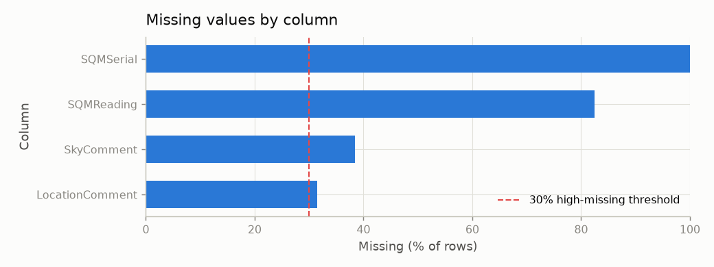
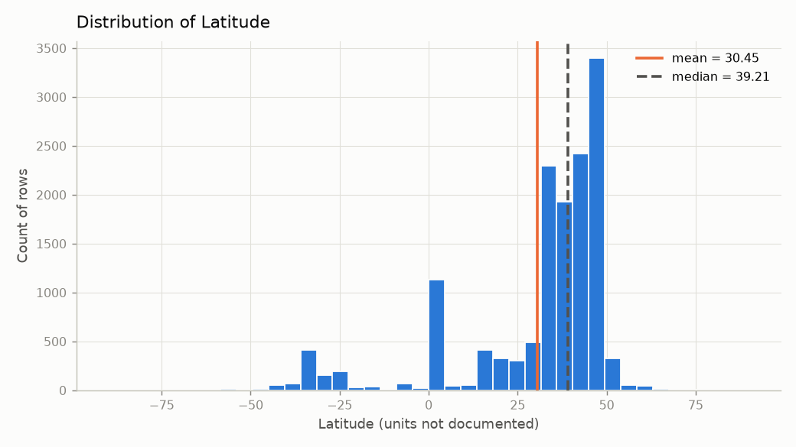
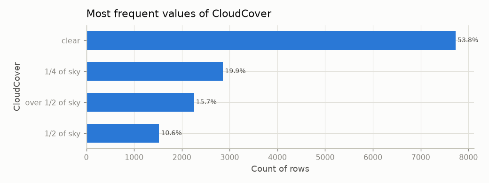
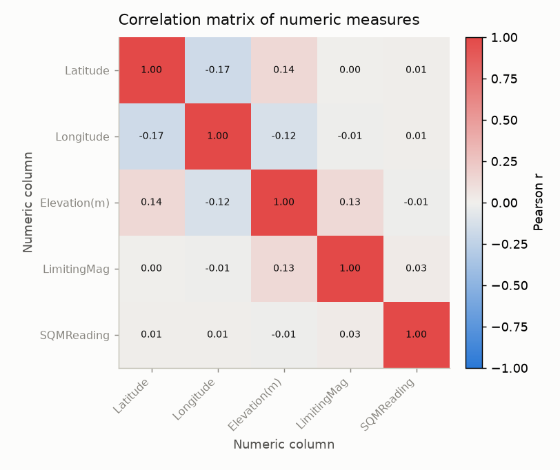
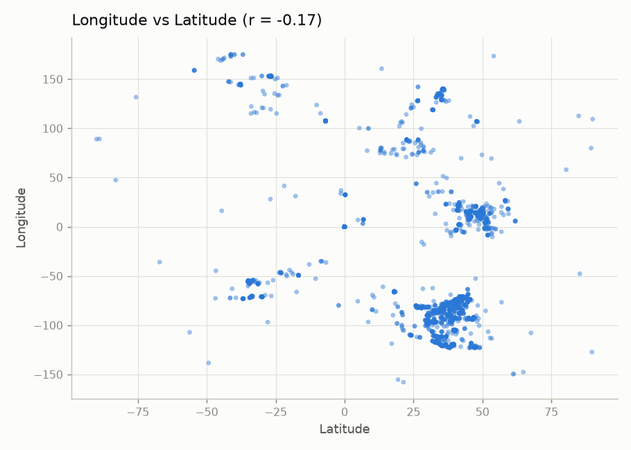
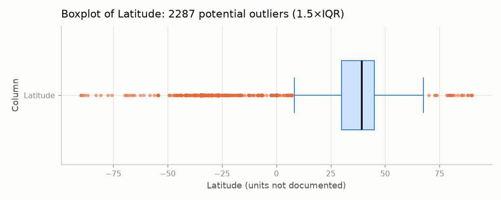
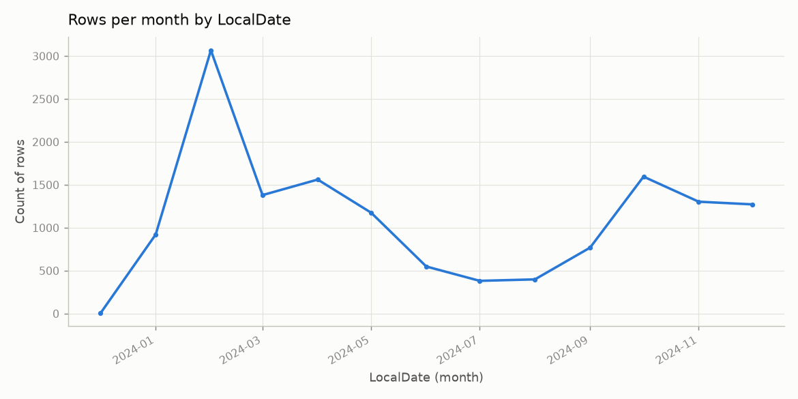
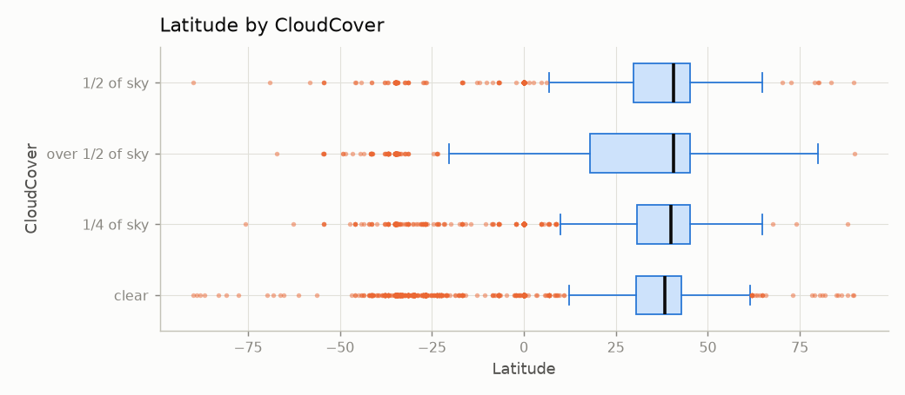

# Automated Data Profile: `dataset_b.csv`

*Generated by `profiler.py` on 2026-09-27 19:23:48. All statistics were computed by Python; the AI narrative (if present) only explains them and is automatically checked.*

## 1. Dataset overview

| Item | Value |
|---|---|
| File | `dataset_b.csv` |
| Rows | 14,373 |
| Columns | 17 |
| Encoding used to read file | utf-8 |
| Role counts | Identifier-like field: 1, Categorical attribute: 4, Numeric measure: 6, Date-like field: 4, Free-text field: 2 |

### Column profile

| Column | Inferred type | Probable role | Non-missing | Missing % | Unique | Notes |
|---|---|---|---:|---:|---:|---|
| `ID` | integer | Identifier-like field | 14,373 | 0.0 | 14,373 | unique integer sequence or ID-like name; excluded from statistics that assume a measurement |
| `ObsType` | string | Categorical attribute | 14,373 | 0.0 | 1 |  |
| `Latitude` | float | Numeric measure | 14,373 | 0.0 | 9,356 |  |
| `Longitude` | float | Numeric measure | 14,373 | 0.0 | 9,356 |  |
| `Elevation(m)` | float | Numeric measure | 14,373 | 0.0 | 7,466 |  |
| `LocalDate` | datetime (text) | Date-like field | 14,373 | 0.0 | 367 |  |
| `LocalTime` | datetime (text) | Date-like field | 14,373 | 0.0 | 1,071 |  |
| `UTDate` | datetime (text) | Date-like field | 14,373 | 0.0 | 366 |  |
| `UTTime` | datetime (text) | Date-like field | 14,373 | 0.0 | 1,366 |  |
| `LimitingMag` | integer | Numeric measure | 14,373 | 0.0 | 8 | only 8 distinct integer values; may be a coded category |
| `SQMReading` | float | Numeric measure | 2,514 | 82.51 | 846 |  |
| `SQMSerial` | integer | Numeric measure | 1 | 99.99 | 1 | only 1 distinct integer values; may be a coded category |
| `CloudCover` | string | Categorical attribute | 14,373 | 0.0 | 4 |  |
| `Constellation` | string | Categorical attribute | 14,373 | 0.0 | 13 |  |
| `SkyComment` | string | Free-text field | 8,856 | 38.38 | 6,231 |  |
| `LocationComment` | string | Free-text field | 9,846 | 31.5 | 6,310 |  |
| `Country` | string | Categorical attribute | 14,373 | 0.0 | 148 |  |

*Roles are inferred from values and names only. Column meanings, units, and valid ranges are not documented in the CSV, so they are not assumed.*

## 2. Data quality

- **Duplicate rows:** 0 (0.0%)
- **Missing cells overall:** 36,275 (14.85% of all cells), in 4 column(s)
- **High-missingness columns (≥ 30.0%):** `SQMSerial` (99.99%), `SQMReading` (82.51%), `SkyComment` (38.38%), `LocationComment` (31.5%)
- **Constant (single-value) columns:** `ObsType`, `SQMSerial`
- **Completely empty columns:** none
- **Mixed / inconsistent types:** none detected
- **Identifier-like / high-cardinality columns:** `ID` (14,373 unique)
- **Potentially sensitive columns (heuristic):** `Latitude` (column name suggests precise location); `Longitude` (column name suggests precise location)

> Sensitive-field detection is a name/pattern heuristic only. The absence of a warning does NOT mean the dataset is free of sensitive information.

> No rows, values, or outliers were removed or changed. Problems are flagged only.

## 3. Descriptive statistics

### Numeric columns

| Column | Valid | Missing (%) | Min | Q1 | Median | Mean | Q3 | Max | Std | IQR | Mode | Outliers (%) |
|---|---:|---:|---:|---:|---:|---:|---:|---:|---:|---:|---|---:|
| `Latitude` | 14,373 | 0 (0.0) | -90.0 | 29.9786 | 39.2118 | 30.4498 | 45.0789 | 89.9991 | 22.0046 | 15.1004 | n/a | 2,287 (15.91) |
| `Longitude` | 14,373 | 0 (0.0) | -178.9018 | -86.7973 | -66.045 | -33.9207 | 14.1116 | 176.8704 | 66.8722 | 100.9088 | n/a | 48 (0.33) |
| `Elevation(m)` | 14,373 | 0 (0.0) | -5612.05 | 28.59 | 166.81 | 242.0788 | 288.53 | 4355.27 | 469.6748 | 259.94 | n/a | 1,139 (7.92) |
| `LimitingMag` | 14,373 | 0 (0.0) | 0.0 | 0.0 | 2.0 | 2.2688 | 4.0 | 7.0 | 1.999 | 4.0 | 0.0 | 0 (0.0) |
| `SQMReading` | 2,514 | 11,859 (82.51) | 0.01 | 16.0 | 18.83 | 37651172.3551 | 20.64 | 94645484946.0 | 1887631642.1826 | 4.64 | 1.0 | 482 (19.17) |
| `SQMSerial` | 1 | 14,372 (99.99) | 0.0 | 0.0 | 0.0 | 0.0 | 0.0 | 0.0 | None | 0.0 | n/a | 0 (0.0) |

*Outliers use the 1.5×IQR rule: values below Q1 − 1.5·IQR or above Q3 + 1.5·IQR. They are potential outliers to investigate, not errors. Std is the sample standard deviation (n − 1). Mode is shown only when values repeat.*

### Categorical and Boolean columns

**`ObsType`** — 1 categories, 14,373 non-missing. Most frequent: 'GAN' (14,373 rows, 100.0%).

| Value | Count | % of non-missing |
|---|---:|---:|
| GAN | 14,373 | 100.0 |

**`CloudCover`** — 4 categories, 14,373 non-missing. Most frequent: 'clear' (7,731 rows, 53.79%).

| Value | Count | % of non-missing |
|---|---:|---:|
| clear | 7,731 | 53.79 |
| 1/4 of sky | 2,862 | 19.91 |
| over 1/2 of sky | 2,255 | 15.69 |
| 1/2 of sky | 1,525 | 10.61 |

**`Constellation`** — 13 categories, 14,373 non-missing. Most frequent: 'Orion' (4,625 rows, 32.18%).

| Value | Count | % of non-missing |
|---|---:|---:|
| Orion | 4,625 | 32.18 |
| Pegasus | 2,391 | 16.64 |
| Cygnus | 2,312 | 16.09 |
| Leo | 2,177 | 15.15 |
| Crux | 665 | 4.63 |
| Hercules | 497 | 3.46 |
| Bootes | 395 | 2.75 |
| Scorpius | 331 | 2.3 |
| Perseus | 316 | 2.2 |
| Grus | 229 | 1.59 |
| *(3 other categories)* | 435 | 3.03 |

**`Country`** — 148 categories, 14,373 non-missing. Most frequent: 'Croatia' (2,531 rows, 17.61%).

| Value | Count | % of non-missing |
|---|---:|---:|
| Croatia | 2,531 | 17.61 |
| United States - Alabama | 1,980 | 13.78 |
| United States - Pennsylvania | 972 | 6.76 |
| Macedonia | 804 | 5.59 |
| Puerto Rico | 622 | 4.33 |
| Uruguay | 390 | 2.71 |
| United States - Texas | 380 | 2.64 |
| United States - California | 342 | 2.38 |
| United States - Missouri | 307 | 2.14 |
| United States - Arizona | 299 | 2.08 |
| *(138 other categories)* | 5,746 | 39.98 |

### Date-like columns

| Column | Valid | Earliest | Latest | Span (days) | Unique dates |
|---|---:|---|---|---:|---:|
| `LocalDate` | 14,373 | 2023-12-31T00:00:00 | 2024-12-31T00:00:00 | 366 | 367 |
| `LocalTime` | 14,373 | 2026-09-27T00:00:00 | 2026-09-27T23:59:00 | 0 | 1071 |
| `UTDate` | 14,373 | 2024-01-01T00:00:00 | 2024-12-31T00:00:00 | 365 | 366 |
| `UTTime` | 14,373 | 2026-09-27T00:00:00 | 2026-09-27T23:59:00 | 0 | 1366 |

## 4. Relationships between variables

Method: Pearson correlation (pairwise complete observations) on 5 numeric measure columns (identifier-like columns excluded).

| Direction | Column A | Column B | Pearson r | Strength | Complete pairs |
|---|---|---|---:|---|---:|
| Positive | `Latitude` | `Elevation(m)` | 0.137 | weak | 14,373 |
| Positive | `Elevation(m)` | `LimitingMag` | 0.131 | weak | 14,373 |
| Positive | `LimitingMag` | `SQMReading` | 0.029 | very weak | 2,514 |
| Negative | `Latitude` | `Longitude` | -0.169 | weak | 14,373 |
| Negative | `Longitude` | `Elevation(m)` | -0.118 | weak | 14,373 |
| Negative | `Longitude` | `LimitingMag` | -0.011 | very weak | 14,373 |

*Strength scale: |r| < 0.1 very weak, < 0.3 weak, < 0.7 moderate, >= 0.7 strong. Correlation measures linear association only and does not imply causation.*

## 5. Visualizations

### Figure 1. Missing values by column



*Why this plot:* Shows which columns are incomplete and which cross the high-missingness threshold.

### Figure 2. Distribution of Latitude



*Why this plot:* A histogram suits a continuous numeric measure: it shows shape, skew, and spread.

### Figure 3. Most frequent values of CloudCover



*Why this plot:* A sorted bar chart compares category frequencies for a categorical attribute.

### Figure 4. Correlation matrix of numeric measures



*Why this plot:* A heatmap summarizes all pairwise linear correlations among numeric measures at once.

### Figure 5. Longitude vs Latitude (r = -0.17)



*Why this plot:* A scatterplot shows the strongest numeric pair so the correlation can be checked visually (linearity, clusters, outliers).

### Figure 6. Boxplot of Latitude: 2287 potential outliers (1.5×IQR)



*Why this plot:* A boxplot shows the median, IQR, and points beyond the 1.5×IQR fences (potential outliers).

### Figure 7. Rows per month by LocalDate



*Why this plot:* A time-series line shows how record volume changes over the date range.

### Figure 8. Latitude by CloudCover



*Why this plot:* Side-by-side boxplots compare a numeric measure across the categories of a categorical attribute.

**Plots skipped and why:**

- hist (Longitude): plot budget of 8 reached
- catbar (Constellation): plot budget of 8 reached

## 6. Key findings computed by Python

*These findings are generated from templates filled directly with values from `analysis_summary.json`; they are always produced, even without an LLM.*

1. **[Data Quality]** `SQMSerial` is missing for 14,372 of 14,373 rows (99.99%), above the 30.0% high-missingness threshold; 4 column(s) exceed it in total.  
   <sub>Evidence: `data_quality.high_missing_columns`</sub>
2. **[Distribution]** `SQMReading` has median 18.83 and mean 37,651,172.3551 (IQR 16.0 to 20.64); 482 values (19.17%) fall outside the 1.5×IQR fences [9.04, 27.6] and are flagged, not removed.  
   <sub>Evidence: `numeric_statistics[SQMReading]`</sub>
3. **[Distribution]** `SQMReading` is strongly right-skewed (long upper tail): skewness 50.1398, mean 37,651,172.3551 vs median 18.83, range 0.01 to 94,645,484,946.0. The median is the more robust center.  
   <sub>Evidence: `numeric_statistics[SQMReading].skewness`</sub>
4. **[Categorical]** In `CloudCover`, the most frequent value 'clear' accounts for 7,731 of 14,373 non-missing rows (53.79%) across 4 categories.  
   <sub>Evidence: `categorical_statistics[CloudCover]`</sub>
5. **[Relationship]** The strongest linear relationship found is between `Latitude` and `Longitude` (Pearson r = -0.169, weak, n = 14,373 complete pairs). This is an association, not evidence of causation.  
   <sub>Evidence: `relationships.strongest_positive / strongest_negative`</sub>
6. **[Limitation]** Limitation: 2 column(s) were flagged as potentially sensitive by name/pattern heuristics; column meanings and units are not documented in the file, so no units or definitions are assumed.  
   <sub>Evidence: `columns, data_quality`</sub>
7. **[Follow-Up Question]** Question for further investigation: Is missingness in `SQMSerial` random, or concentrated in particular categories or time periods?  
   <sub>Evidence: `derived from the findings above`</sub>

## 7. AI-assisted narrative insights

*Model: `llama3.2` via Ollama. Prompt saved in `llm_prompt.txt`, raw response in `llm_response.txt`. The model received only the Python-verified summary. Attempts: 1.*

1. [Data quality] The dataset has 14373 rows, but 14372 of the `SQMSerial` values are missing, indicating a high percentage of missing data in this column.
2. [Distribution] The `Latitude` values have a mean of 30.4498 and a standard deviation of 22.0046, indicating a relatively normal distribution.
3. [Categorical] The `ObsType` column has only one unique category, `GAN`, which accounts for all 14373 rows, indicating a lack of diversity in this categorical attribute.
4. [Relationship] The strongest positive correlation is between `Latitude` and `Elevation(m)` with a Pearson correlation coefficient of 0.137, indicating a weak linear association.
5. [Limitation] The correlation measures linear association only and does not imply causation, so any observed relationships should be interpreted with caution.
6. [Question] What is the relationship between the `SQMReading` values and the `LimitingMag` values, given that the correlation between these variables is very weak (0.029)?
7. [Distribution] The `SQMReading` values have a mean of 37651172.3551 and a standard deviation of 1887631642.1826, indicating a highly skewed distribution.
8. [Data quality] The `Country` column has 148 unique values, but the top categories only account for a small percentage of the total, indicating a lack of representation for some countries.

### Automatic verification of the AI narrative

Every number in the response was compared with the values in `analysis_summary.json` (matching at the precision the model wrote). Each number must match a value Python computed for the column(s) the claim names, or a dataset-wide value such as the row count. Statistic words (mean, median, std, min, max, skewness, IQR, correlation) are checked against that exact statistic. "✓ numbers verified" does NOT mean the wording or reasoning is correct; a person must still read every claim.

| # | Claim (truncated) | Columns named | Numbers checked | Numbers not found for those columns | Statistic mismatches | Causal wording | Status |
|---|---|---|---:|---|---|---|---|
| 1 | [Data quality] The dataset has 14373 rows, but 14372 of the `SQMSerial` values are missin… | `SQMSerial` | 2 | – | – | – | ✓ numbers verified |
| 2 | [Distribution] The `Latitude` values have a mean of 30.4498 and a standard deviation of 2… | `Latitude` | 2 | – | – | – | ✓ numbers verified |
| 3 | [Categorical] The `ObsType` column has only one unique category, `GAN`, which accounts fo… | `ObsType` | 1 | – | – | – | ✓ numbers verified |
| 4 | [Relationship] The strongest positive correlation is between `Latitude` and `Elevation(m)… | `Latitude`, `Elevation(m)` | 1 | – | – | – | ✓ numbers verified |
| 5 | [Question] What is the relationship between the `SQMReading` values and the `LimitingMag`… | `SQMReading`, `LimitingMag` | 1 | – | – | – | ✓ numbers verified |
| 6 | [Distribution] The `SQMReading` values have a mean of 37651172.3551 and a standard deviat… | `SQMReading` | 2 | – | – | – | ✓ numbers verified |
| 7 | [Data quality] The `Country` column has 148 unique values, but the top categories only ac… | `Country` | 1 | – | – | – | ✓ numbers verified |

**Verification summary:** 10 numbers checked, 10 matched the Python summary, 0 did not; 0 claim(s) had a statistic mismatch; 0 claim(s) used causal wording.

## 8. Limitations of this automated analysis

- Type and role inference is heuristic (value parsing and column-name patterns); it can misclassify coded numbers, ZIP codes, or IDs.
- Column meanings, units, and valid ranges are not known unless documented; the report does not assume them.
- Outliers are flagged with the 1.5×IQR rule, which assumes a roughly symmetric distribution and over-flags skewed data.
- Pearson correlation captures only linear association, is sensitive to outliers, and never establishes causation.
- Sensitive-data detection is a heuristic; no warning does not mean the data is safe.
- The LLM narrative may still contain wording problems that the automatic number check cannot catch; it must be reviewed by a person.

## 9. Configuration used

```json
{
  "missing_threshold_pct": 30.0,
  "numeric_parse_threshold": 0.95,
  "date_parse_threshold": 0.9,
  "high_cardinality_ratio": 0.9,
  "max_categories": 50,
  "free_text_min_avg_len": 30,
  "top_k_categories": 10,
  "max_plots": 8,
  "extra_na_values": [],
  "iqr_multiplier": 1.5,
  "llm_model": "llama3.2",
  "ollama_url": "http://localhost:11434/api/generate",
  "llm_timeout_sec": 300,
  "llm_num_ctx": 8192,
  "llm_max_attempts": 2
}
```
